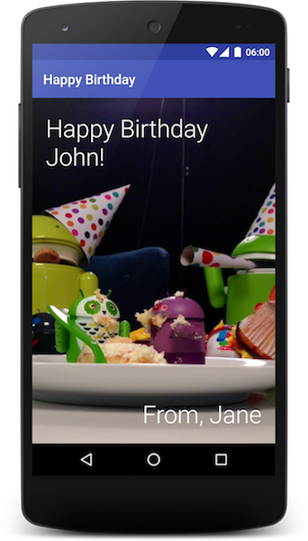

## Udacity Android Development For Beginners

###### <https://www.udacity.com/course/android-development-for-beginners--ud837>

#### Course Summary

Learn the basics of Android and Java programming, and take the first step on your journey to becoming an Android developer!

This course is designed for students who are new to programming, and want to learn how to build Android apps. You don’t need any programming experience to take this course. If you’ve been using a smartphone to surf the web and chat with friends, then you’re our perfect target student!

Learning anything new can be tough. We will walk you through the process of making Android apps, but to get the most out of this course, you must bring your enthusiasm for learning, and budget time on your calendar to learn with us.

By the end of the course, you’ll build two simple (but powerful) apps that you can share with your friends. We also hope that you will learn enough through this course to decide how best to continue your journey as an Android app developer, if you’re interesting in pursuing such a path.

#### Syllabus

| Week | Topics |
|:----:|--------|
| Lesson 1: Building Layouts | Take your hand drawn app designs and lay them out on the phone screen. In this lesson you’ll learn the XML markup language used to lay out Android applications. You’ll create views, the basic building block of Android layouts, that display text and images. Then you’ll position your text and images on these screens. This highly interactive lesson encourages experimentation through coding challenges in Udacity’s XML Visualizer. |
| Practice Set 1 | Create a birthday card application for your phone. You’ll start by installing Android Studio, a program used by professional developers to make Android applications. You’ll then transfer a simple application you create from your computer to your phone. Following that, you’ll take all the concepts you learned in Lesson 1 to build your birthday card app, and install it on your phone for your friends and family to see. |
| Lesson 2: Making an App Interactive | Harness the power of Java to create an interactive coffee ordering app! You’ll start by writing simple statements in Java that add interactivity to your app. You’ll then incorporate buttons to trigger events. You’ll finally use a fundamental concept in programming, a variable, to keep track of all the coffee drinks ordered. |
| Practice Set 2 | Reinforce the skills learned in Lesson 2 by creating a basketball score tracker. The first part of the practice set will solidify how to write and use variables before creating your basketball score tracker app. |
| Lesson 3: Work with the Android Framework and Control Flow | Take a deeper dive into the Android Framework to complete the Just Java coffee ordering app! You’ll see in more detail how Android works behind the scenes and take your first steps towards learning Object Oriented Programming. You’ll add the ability to add toppings to your coffee, and show a detailed order summary when the customer purchases a coffee. |

#### Screenshot

